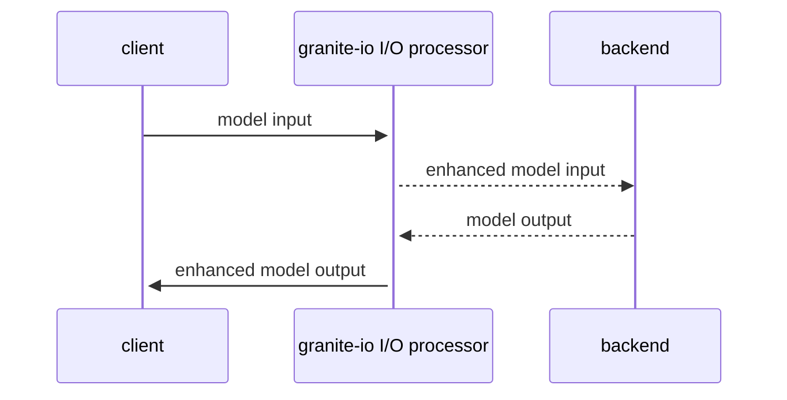

# Granite IO Processing

## Introduction

Granite IO Processing is a framework which enables you to transform how a user calls or infers an IBM Granite model and how the output from the model is returned to the user. In other words, the framework allows you to extend the functionality of calling the model.

> Note: This framework is composable and is intended to be used to build more complex workflows, but the "getting started" workflow looks like this:



## Getting Started

### Requirements

* Python 3.10+

### Installation

We recommend using a Python [virtual environment and pip](https://packaging.python.org/en/latest/guides/installing-using-pip-and-virtual-environments/). Otherwise, you may have issues with installed packages not being found. Here is how to setup a virtual environment using [Python venv](https://docs.python.org/3/library/venv.html):

```
python3 -m venv granite_io_venv
source granite_io_venv/bin/activate
```

#### Install granite-io

To install from releases ([PyPI package](https://pypi.org/project/granite-io/)):

```shell
pip install granite-io
```
#### Install NLTK data (punkt_tab)

`granite-io` uses [NLTK Data](https://www.nltk.org/data.html) [Punkt Sentence Tokenizer](https://www.nltk.org/api/nltk.tokenize.punkt.html) for extracting contents when parsing output from a model. Check out [Installing NLTK Data](https://www.nltk.org/install.html#installing-nltk-data) for more detailed instructions.  Install punkt_tab data:

```shell
python -m nltk.downloader punkt_tab
```

#### Install granite-io backend extras

Each backend provider, such as OpenAI or LiteLLM, has extra requirements. Install the extras for the backend(s) you intend to use:

```shell
pip install "granite-io[litellm]"       # For LiteLLM
pip install "granite-io[openai]"        # For OpenAI API
pip install "granite-io[transformers]"  # For Transformers
```

### Framework Example

> To be able to run the following code snippet, you will need an [Ollama](https://ollama.com/) server [running locally](https://github.com/ollama/ollama?tab=readme-ov-file#start-ollama) and [IBM Granite 3.2](https://www.ibm.com/granite) model cached (`ollama pull granite3.2:8b`).

Simple code snippet showing how to use the framework:

```py
from granite_io import Granite3Point2InputOutputProcessor
from granite_io import OpenAIBackend

# Example using Granite 3.2 processor with OpenAIBackend defaults (local Ollama)
processor = Granite3Point2InputOutputProcessor(backend=OpenAIBackend())

messages = [
  {
    "role": "user",
    "content": "What team is the most successful hurling team in the last 10 years?",
  },
]

# Try a simple chat completion with the above messages and enable thinking
outputs = processor.create_chat_completion(messages=messages, thinking=True)

# Note: The reasoning is separated from the response
print("------ WITH THINKING ------")
print("\n>> Response:\n")
print(outputs.results[0].next_message.content)
print("\n>> Thoughts:\n")
print(outputs.results[0].next_message.reasoning_content)

print("\n")
print("+---------------------------------------------------------------------------")
print("| That was easy and we can see the reasoning!!")
print("| Now try using some other options (documents, citations and temperature)...")
print("+---------------------------------------------------------------------------")
print("\n")

# Add documents for RAG
documents = [
  {
    # Source: https://en.wikipedia.org/wiki/Limerick_county_hurling_team
    "text": "The 2018 season concluded with Limerick winning the 2018 All-Ireland SHC, the team's first since 1973, with a 3–16 to 2–18 point defeat of Galway in the final.The team built on this success, winning the NHL in 2019, 2020 and 2023, the Munster SHC in 2019, 2020, 2021 and 2022 and the All-Ireland SHC again in 2020, 2021 and 2022. Munster Senior Hurling Championship 2023, All Ireland Hurling Championship 2023 to be forever remembered the team to join the Cork hurling Champions of the 40s and the Kilkenny hurling Champions of the 2000s to complete 4 in a row."  # noqa: E501
  },
]

# Additional controls for Granite 3.2
controls = {
  "citations": True,
}

# Additional kwargs for text completion (generate)
generate_kwargs = {
  "temperature": 0.2,
  "frequency_penalty": 1.5,
  "max_tokens": 10000,
}

# Now try completion with thinking, controls, and additional kwargs
outputs = processor.create_chat_completion(
  messages=messages,
  controls=controls,
  documents=documents,
  generate_inputs=generate_kwargs,
  thinking=False,
)

print("------ USING DOCUMENTS WITH CITATIONS ------")
print("\n>> Response:\n")
print(outputs.results[0].next_message.content)
print("\n>> Citations:\n")
for citation in outputs.results[0].next_message.citations:
  print(f"{citation.citation_id}.{citation.doc_id}): {citation.context_text}")
```

## Features

### Input processing

Structured input allows simplified usage of advanced model features.

* Input messages, tools, documents, and controls
* Controls:
  * Response length
  * Thinking (reasoning)
  * Citations
* Input enhancements
  * Final prompt based on structured input
  * Injection of current date/time

### Output processing

Structured output separates supporting information from the final response.

* Output enhancements
  * Filtered final answer(s)
  * Additional attributes for supporting information
* Structured output attributes:
  * Response
  * Thoughts (reasoning)
  * Citations

### Backends

`granite-io` includes backends to support popular LLM provider APIs:

* OpenAI API
* LiteLLM
* Transformers

### Supported models

`granite-io` is intended to be somewhat model-agnostic, but the first releases are very focused on [Granite 3.2 Language Models](https://huggingface.co/collections/ibm-granite/granite-32-language-models-67b3bc8c13508f6d064cff9a).

### Try It Out!

To help you get up and running as quickly as possible with the Granite IO Processing framework, check out the following resources which demonstrate further how to use the framework:

1. Python script examples:

> [!IMPORTANT]
> To get started with the examples, make sure you have followed the [Installation](#installation) steps first.
> You will need additional packages to be able to run the examples. They can be installed by running `pip install -e "granite-io[openai]"` and `pip install -e "granite-io[litellm]`. Replace package name `granite-io` with `.` if installing from source.
>
> You will also need an [Ollama](https://ollama.com/) server [running locally](https://github.com/ollama/ollama?tab=readme-ov-file#start-ollama) and [IBM Granite 3.2](https://www.ibm.com/new/announcements/ibm-granite-3-2-open-source-reasoning-and-vision) model cached (`ollama pull granite3.2:8b`).

   - [Granite 3.2 chat request](./examples/model_chat.py)
   - [Granite 3.2 chat request with thinking](./examples/inference_with_thinking.py)
   - [Using watsonx.ai](./examples/watsonx_litellm.py)

2. Jupyter notebook tutorials:

> [!IMPORTANT]
> To get started with the examples, make sure you have followed the [Installation](#installation) steps first. You will also need additional packages to be able to run the Jupyter notebook. They can be installed by running `pip install -e "granite-io[transformers]"` and `pip install -e "granite-io[notebook]"`. Replace package name `granite-io` with `.` if installing from source. The notebooks can be then run with following command `jupyter notebook <path_to_notebook>`.

   - [IO](./notebooks/io.ipynb)

## Architecture

For more information about architecture and design decisions, refer to [docs/design.md](docs/design.md).

## Contributing

Check out our [contributing guide](CONTRIBUTING.md) to learn how to contribute.
